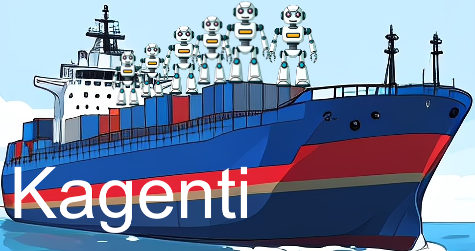

**Kagenti** is a Kubernetes-based middleware providing a *framework-neutral*, *scalable* and *secure* platform for deploying and orchestrating AI agents through a standardized REST API. It includes key services such as:

- Trusted identity
- Deployment
- Configuration
- Scaling
- Fault-tolerance
- Checkpointing
- Discovery of agents and tools
- Persistence

## Value Proposition

Despite the extensive variety of frameworks available for developing agent-based applications, there is a distinct lack of standardized methods for deploying and operating agent code in production environments, as well as for exposing it through a standardized API. Agents are adept at reasoning, planning, and interacting with various tools, but their full potential can be limited by these deployment challenges. **Kagenti** addresses this gap by enhancing existing agent frameworks with the following key components:

1. **Agent Multi-Framework Provider (AMF)**: This component enables the creation of multi-framework agent-based workflows via the [Llama Agent API](https://llama-stack.readthedocs.io/en/latest/references/api_reference).

2. **Kubernetes Platform Operator**: Facilitates the deployment and configuration of agents along with infrastructure dependencies on Kubernetes. It enables scaling and updating configurations seamlessly.

3. **Scalable Web-Queue-Worker Pattern**: This pattern, implemented as part of the AMF provider, facilitates independent scaling of agents and tools separate from the API server. It acts as a "shock absorber" to handle sudden bursts in inbound requests for initiating agent-based workflows.

4. **Agent and Tool Authorization Pattern**: This pattern replaces static credentials with dynamic SPIRE-managed identities, enforcing least privilege and continuous authentication. Secure token exchanges ensure end-to-end security principles enforcement across agentic workflows.

## Multi-Framework Agents

In the open-source community, several frameworks are emerging for developing agent-based applications. These include **LangGraph**, **CrewAI**, **AG2**, **Llama Stack**, and **BeeAI**. The selection of a specific framework is often driven by the use case requirements. For scenarios requiring complex orchestration with a high degree of control over the agent workflow, frameworks like LangGraph are usually a better fit. They allow explicit graph creation where nodes perform LLM model inference and tool calls, with routing that can be either predefined or dynamically influenced by LLM decisions. On the other hand, frameworks such as CrewAI are designed to assign roles and tasks to agents, enabling them to autonomously work towards achieving predefined goals. Llama Stack agents are primarily pre-built state machines focused on ReAct-style patterns. Users configure the system’s prompts, tools, models, and then simply input data and prompts, allowing the agent to execute without the need for backend code development.

**Kagenti** provides a unified platform to deploy, scale, configure, and orchestrate agents created across these various frameworks by offering a common front-end API.

## Kubernetes Operator

Deploying agents in production involves addressing typical challenges associated with managing complex microservices-based applications, including managing infrastructure services such as key-value store databases, caches, queuing systems and deployment, configuration management and scaling of API servers, and workers. The Kubernetes operator facilitates the deployment of new framework instances, supports the registration and scaling of multi-framework agents, and assists in setting up and configuring identity management and agents' authorizations.

## Scalable Web-Queue-Worker Pattern

The *Web-Queue-Worker* pattern, a best practice for microservices architectures, provides several key advantages over direct HTTP calls from the API server to backend components:

- **Scalability**: facilitates independent scaling of workers from the API server, enhancing flexibility.

- **Resilience and Fault Tolerance**: ensures tasks are retained in the queue during service downtime, providing inherent fault tolerance.

- **Load Management**: acts as a buffer managing demand spikes by queuing requests until resources become available and enhances resource utilization by distributing work over time based on worker availability.

## Agent and Tool Authorization Pattern

The Agent and Tool Authorization Pattern for the Agentic Platform ensures that both human and machine identities are continuously authenticated and authorized, minimizing implicit trust at every stage of interaction. Traditional static credentials, such as API keys or client secrets, risk privilege escalation and credential leaks, and therefore are replaced with dynamic, short-lived identity-based tokens, managed through SPIRE and integrated with Keycloak for access control.

This approach enforces least privilege access by ensuring that identities — whether users, tools, or external services — only receive the minimum permissions necessary. The authentication and authorization flow follows a structured token exchange mechanism, where a user's identity propagates securely through the system, from initial authentication to tool interactions and external service access. By leveraging SPIFFE/SPIRE for workload identity and OAuth2 transaction tokens for controlled delegation, the platform prevents credential misuse, reduces attack surfaces, and ensures real-time policy enforcement.

In practice, the Authorization Pattern within the Agentic Platform enables:

- Machine Identity Management – replacing static credentials with SPIRE-issued JWTs.
- Secure Delegation – enforcing token exchange to propagate identity across services without excessive permissions.
- Continuous Verification – ensuring authentication and authorization at each step, preventing privilege escalation.

This end-to-end approach aligns agentic workflows with security best practice principles, making them secure, scalable, and eventually production-ready.

## PoCs

To achieve the objectives outlined above, we are developing this technology through a series of Proofs of Concept (PoCs), each targeting specific aspects of our goals. Our aim is to refine these experiments into an initial Minimum Viable Product (MVP) architecture.

For following set of PoCs, we have selected [Llama Stack](https://llama-stack.readthedocs.io), a versatile software stack tailored for building applications that utilize Large Language Models (LLMs).

1. [Installation](./docs/pocs.md#installation)
2. [Multi-Framework Agent Provider](./docs/pocs.md#multi-framework-agent-provider)
3. [API Key Propagation](./docs/pocs.md#api-key-propagation-from-ls-client-to-mcp-tool-server)
4. [Agent as MCP Tool](./docs/pocs.md#agent-as-tool)
5. [Distributed Agents with Web-Queue-Worker pattern](./docs/pocs.md#web-queue-worker-pattern)
